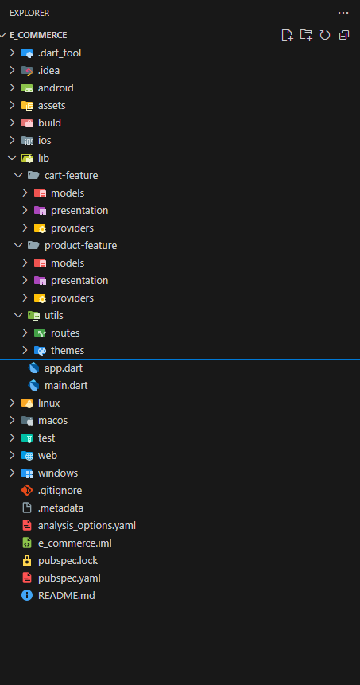

# Flutter E-Commerce App 🛍️

A modern, scalable Flutter e-commerce application built to showcase professional development skills to potential employers. This app demonstrates clean architecture, state management, and best practices for production-ready Flutter applications.

## Features

### Current Implementation

- Product Catalog - Browse products with beautiful UI

- Shopping Cart - Add/remove items with quantity management

- Wishlist - Save favorite products for later

- Responsive Design - Optimized for various screen sizes

- Dark/Light Theme - Theme-aware UI components

- State Management - Efficient state handling with Provider

### Future Enhancements

- User Authentication & Profiles

- Payment Integration

- Order Management & Tracking

- Product Search & Filtering

- Product Reviews & Ratings

- Push Notifications

# 🏗️ Architecture & Structure

## Feature-Based Folder Structure

## Key Architectural Principles

- High Cohesion: Related functionality grouped within features

- Low Coupling: Minimal dependencies between features

- Separation of Concerns: Clear division between data, domain, presentation

- Testability: Easy to unit test individual components

- Scalability: Easy to add new features without breaking existing code

## Technology Stack

### Current Stack

- Framework: Flutter 3.x

- State Management: Provider

- Programming Language: Dart

- Architecture: Feature-First + Clean Architecture

- Theming: Material Design 3

## 🤝 Contributing

This project is primarily a showcase for employers, but suggestions for improvements are welcome!

## 📄 License
This project is open source and available under the ...

---

Built with ❤️ using Flutter - Demonstrating professional mobile development skills for modern e-commerce applications.